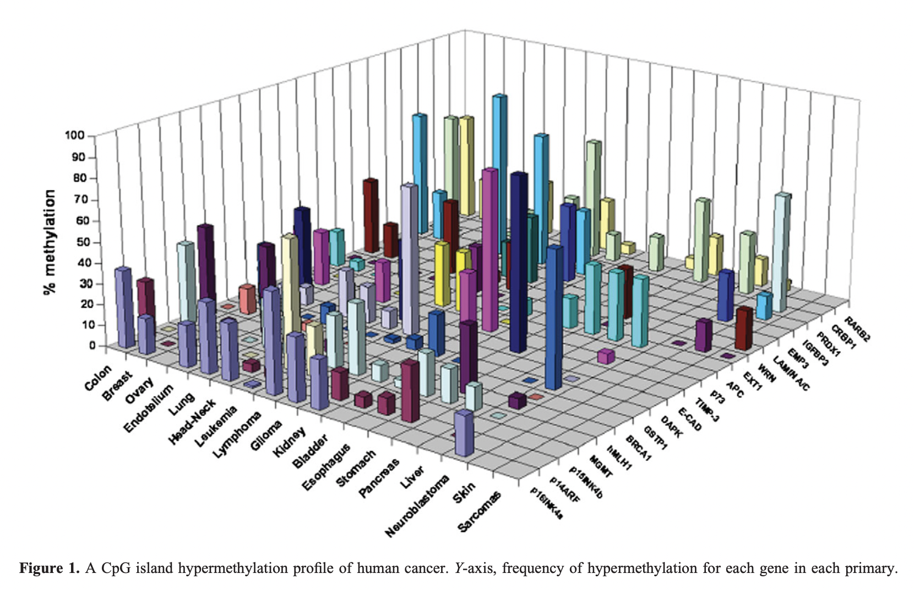

```{r setup, include=FALSE}
knitr::opts_chunk$set(echo = TRUE)
```



## Visualization Link

Please provide a link to your visualization critique.

<https://academic.oup.com/hmg/article-pdf/16/R1/R50/6950364/ddm018.pdf>[https://academic.oup.com/hmg/article-pdf/16/R1/R50/6950364/ddm018.pdf]

## Weakness

What do you see as a significant weakness of this visualization? How could you
improve it to make it clearer, easier to understand, or more impactful? Make
sure you provide some detail in justifying your answer.

* The columns in the foreground completely or partially obscure those in the
  back of the graphic.
* The 3D representation makes it difficult to compare columns that are far apart.
* Perspective makes it difficult to compare columns in foreground with those in
  the background.

It seems the author wanted to present all the information at once, but lost the
message as a result.

A better approach would have been to use a usual 2D barchart and visualize the
**third dimension using facets or color** (stacked or dodged).

## Strength

What do you see as a strength of this visualization? Is there a specific choice
of the designer that made it especially useful or impactful? Make sure you
provide some detail in justifying your answer.

* At least the author used different colors to help identify the related genes.

The publication is already 15 years old and the use of 3D probably due to the
fascination of the technically possible at that time. Today, 3D visualizations
are used much more cautiously - usually when spatial objects are to be
depicted.

